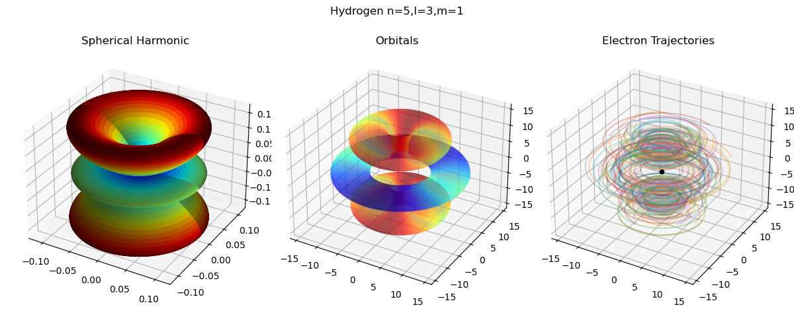

# quantum

An easy-to-use quantum mechanics library with a focus on visualization. 

## Preface

This project is very much inspired by the [stunning visualization](https://www.youtube.com/watch?v=W2Xb2GFK2yc) by Henry Reich. They show bohmian trajectories of electrons in hydrogen-like atoms. But sadly no source code was published. Thus the initial goal of this project was to recreate these visualizations, that is implement the quantum wave function for hydrogen-like atoms and generate the bohmian trajectories from it. But why stop there.

Please note that the overall aim was still of educational nature, i.e. the code is ment to be easy-to-use but also easy-to-read. Thus implementations are not the fastest. However, where possible, algorithms are implemented in a vectorized manner allowing for fast tensor operations using numpy and scipy.

## Requirements

All algorithms and routines are implemented in python using the following dependencies

 - numpy >= 1.21.5
 - scipy >= 1.7.3

However other modules (`matplotlib`, etc.) are used in the examples for visualization. The dependencies can be installed by the following command

```bash
python -m pip install -f requirements.txt
```

## Modules

The library can is separated into the following modular components:

| Module | Desciption |
| :---   | :---       |
| core   | Holds core classes including the `WaveFunction` and `TISE`. |
| analytic | Contains analytic solutions to the schrödinger equation for well-known potentials. This includes the `HydrogenLike` wave funciton. |
| extra | Extra functionality building on top of but is not used within the library. E.g. the `BohmianMechanics` class is part of this module. |
| utils | Utilities used throughout the library. |

## Examples

Several examples showcasing the current state of the `quantum` library can be found in the `example` directory. Some of them are covered below.

### Solving the Time-Indipendent Schrödinger Equation

To solve the time indipendent schrödinger equation one must first define the potential energy function. The function must accept a numpy array of shape (..., ndim) where ndim specifies the dimensionality. The following snipped defined the potential energy for a n-dimensional harmonic oscillator:

```python
V = lambda x: 0.5 * (x**2).sum(axis=-1)
# or using the extra.potentials module
V = quantum.extra.potentials.HarmonicOscillatorPotential(w=1.0)
```

Note that some well-known potentials are defined in the `extra.potentials` module.

Now solving the time-indipendent schrödinger equation for the 2-dimensional harmonic oscillator is as easy as (from `examples/harmonic_oscillator.py`):

```python
eq = quantum.TISE(V)
# solve the equation and return a list of found stable
# states/wave-functions
states = eq.solve(
    # specify the boundary of the grid on which to solve
    # the schroedinger equation. make sure that the bounds
    # are chosen such that the boundary conditions are met,
    # i.e. psi(-inf) = psi(inf) = 0
    bounds=[[-10, 10], [-10, 10]],
    # the distance between points on the regular grid
    dx=0.1,
    # the number of eigenstates to solve for
    # by default will search for the k states with the
    # smallest eigenvalues/energies
    k=2
)
```

Note that the dimensionality is determined by the `bounds` argument, i.e. it specifies the lower and upper bound for each dimension.

The following visualization shows the real and complex components of a wave function for a specific energy value that was generated by the above (from `examples/harmonic_oscillator.py`).


### Superposition: Interference Pattern

A somewhat more involved example is to generate the interference pattern by superimposing free-moving particles. A freely moving particle can be represented by a gaussian wave packet which has an analytic form. The following code snippet creates a wave function that descibes a sinle particle in double slit experiment (from `examples/interference.py`):

```python
wf = quantum.analytic.GaussianWavePacket(v=[0.1, 0.0], x0=[0.0, 1.0], s0=0.2) + \
    quantum.analytic.GaussianWavePacket(v=[0.1, 0.0], x0=[0.0, -1.0], s0=0.2)
```

A simple visualization of the resulting wave function already shows the interference pattern (from `examples/interference.py`) 


### De-Boglie-Bohm Theory: Interference Pattern

Inspired by [this work](https://github.com/daneodekirk/bohm/blob/master/paper.pdf) of Dane Odekirk one can also compute the bohmian trajectories of particles starting out in one of the two slits. First one needs to generate the initial positions of the particles (from `examples/interference.py`):

```python
# create initial particle positions within slits
q = np.random.uniform(-1, 1, size=(num_particles, 1))
q = np.concatenate((
    np.zeros_like(q), 
    1.0 * q + 0.5 * np.sign(q)
), axis=-1)
```

Then the trajectories can be computed using the `BohmianMechanics` class as follows:

```python
# time steps at which to evaluate for their trajectories
t = np.arange(0, 2, 0.01)
# compute bohmian trajectories
Q = quantum.extra.BohmianMechanics(wave=wf).trajectory(q=q, t=t)
```

Visualizing the trajectories yields (from `examples/interference.py`). Note that in comparison to the above interference pattern, here the axes are swapped.


### Hydrogen-Like Atoms

As seen in the above example, the bohmian trajectories can be computed for arbitrary wave functions. Thus one can also generate the bohmian electron trajectories within hydrogen-like atoms. The corresponding wave function can be created by (from `examples/hydrogen.py`):

```python
wf = quantum.analytic.HydrogenLike(5, 3, 1)
```

The easiest way to create initial positions for the trajectories is to simply sample points on the probability density function implied by the wave function. This can be done by using multi-dimensional inverse transfer sampling as follows (from `examples/hydrogen.py`):

```python
# sanple points from probability density at time t=0
s = quantum.utils.sampling.inverse_transfer_sampling(
    pdf=partial(wf.pdf, t=0), 
    num_samples=50000,
    bounds=[[0, 8], [0, 2*np.pi], [0, np.pi]],
    delta=0.05
)
```

Plugging this into the `BohmianMechanics` class and visualizing the corresponding trajectories gives the most right plot in the following figure (from `examples/hydrogen.py`)



## Future Work

 - implement Hartree-Fock method
 - visualize bohmian trajectories for molecular orbits
